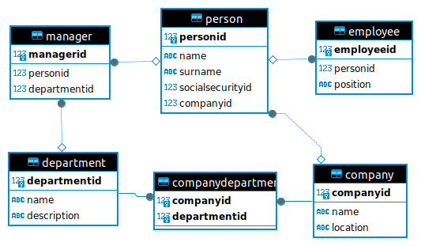

Есть операционная база (postgres) hr-отдела предприятия.

Схема БД:



Инструкция:
- Запустить postgreSQL, создать структуру таблиц и наполнить их данными
- Подключиться к postgresql с помощью clickhouse
- Создать таблицы слоя STAGE
- Организовать хранение данных в слое DDS согласно модели “звезда” или “снежинка”
- В слое CDM отобразить информацию о количестве менеджеров, сотрудников в отделах.

Скрипт для создания таблиц:

```sql
CREATE TABLE Manager (
  ManagerID SERIAL PRIMARY KEY,
  PersonID INT,
  DepartmentID INT,
  FOREIGN KEY (PersonID) REFERENCES Person(PersonID),
  FOREIGN KEY (DepartmentID) REFERENCES Department(DepartmentID)
);

CREATE TABLE Person (
  PersonID SERIAL PRIMARY KEY,
  Name VARCHAR(255),
  Surname VARCHAR(255),
  SocialSecurityID BIGINT,
  CompanyID INT,
  FOREIGN KEY (CompanyID) REFERENCES Company(CompanyID)
);

CREATE TABLE Employee (
  EmployeeID SERIAL PRIMARY KEY,
  PersonID INT,
  Position VARCHAR(255),
  FOREIGN KEY (PersonID) REFERENCES Person(PersonID)
);

CREATE TABLE Company (
  CompanyID SERIAL PRIMARY KEY,
  Name VARCHAR(255),
  Location VARCHAR(255)
);

CREATE TABLE CompanyDepartment (
  CompanyID INT,
  DepartmentID INT,
  PRIMARY KEY (CompanyID, DepartmentID),
  FOREIGN KEY (CompanyID) REFERENCES Company(CompanyID),
  FOREIGN KEY (DepartmentID) REFERENCES Department(DepartmentID)
);

CREATE TABLE Department (
  DepartmentID SERIAL PRIMARY KEY,
  Name VARCHAR(255),
  Description VARCHAR(255)
);
```

```sql

CREATE database company_dwh;
use company_dwh;

drop table Manager;
CREATE TABLE src_manager (
  managerid Int32,
  personid Int32,
  departmentid Int32
) Engine = PostgreSQL('localhost:6432', 'hr_db', 'manager', 'postgres', 'postgres', 'public');
SELECT * from Manager;


CREATE TABLE src_person (
  PersonID SERIAL PRIMARY KEY,
  Name VARCHAR(255),
  Surname VARCHAR(255),
  SocialSecurityID BIGINT,
  CompanyID INT,
  FOREIGN KEY (CompanyID) REFERENCES Company(CompanyID)
);

CREATE TABLE src_employee (
  EmployeeID SERIAL PRIMARY KEY,
  PersonID INT,
  Position VARCHAR(255),
  FOREIGN KEY (PersonID) REFERENCES Person(PersonID)
);

CREATE TABLE src_company (
  CompanyID SERIAL PRIMARY KEY,
  Name VARCHAR(255),
  Location VARCHAR(255)
);

CREATE TABLE src_company_department (
  CompanyID INT,
  DepartmentID INT,
  PRIMARY KEY (CompanyID, DepartmentID),
  FOREIGN KEY (CompanyID) REFERENCES Company(CompanyID),
  FOREIGN KEY (DepartmentID) REFERENCES Department(DepartmentID)
);

drop table Department;
CREATE TABLE src_department (
  departmentid Int32,
  name String,
  description String
) Engine = PostgreSQL('localhost:6432', 'hr_db', 'department', 'postgres', 'postgres', 'public');

CREATE table stg_department Engine = MergeTree() ORDER BY department_id as
select departmentid as department_id, name, description from Department;

CREATE table stg_manager Engine = MergeTree() ORDER BY manager_id as
select managerid as manager_id, personid as person_id, departmentid as department_id from src_manager;

drop table department_stats;
create table department_stats (
	department_name String,
	managers_count AggregateFunction(uniq, Int32)
) Engine = AggregatingMergeTree()
ORDER BY (department_name);


create materialized view mv_department_stats TO department_stats
as select
	d.name as department_name,
	uniqState(m.manager_id) as managers_count
from stg_manager m
left join stg_department d on m.department_id = d.department_id
Group by d.name;

select department_name, uniqMerge(managers_count) as managers
from mv_department_stats
group by department_name
order by department_name ;
```